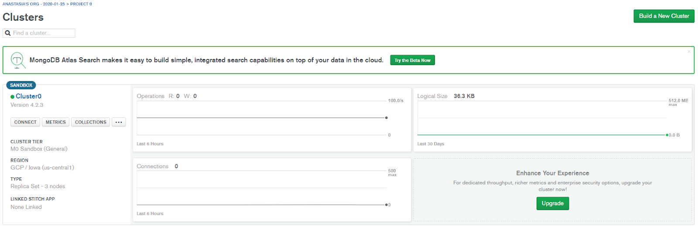
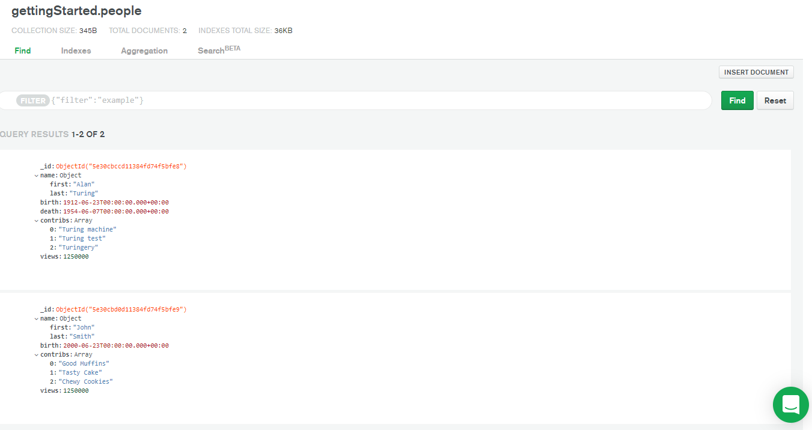
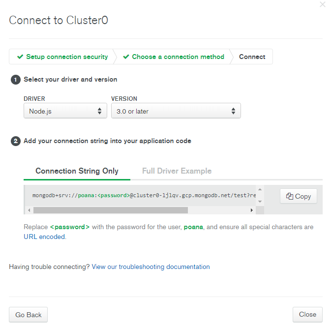
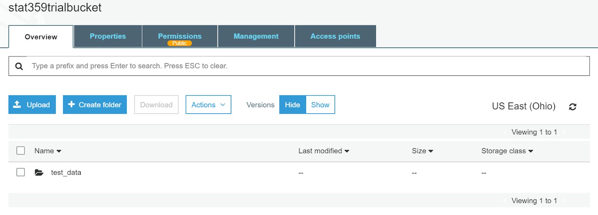
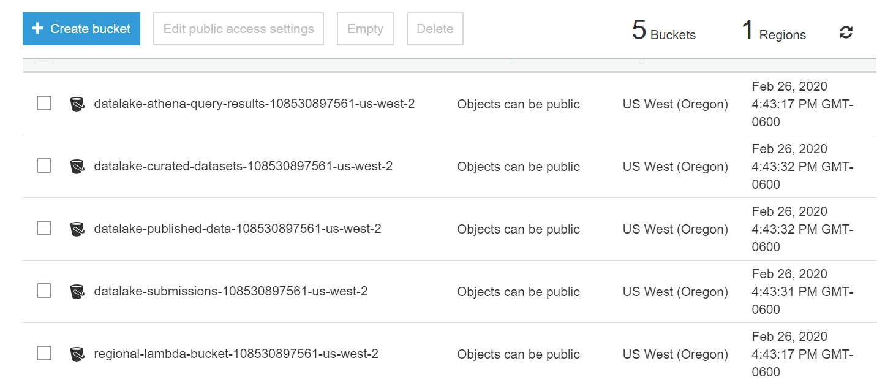

# STAT359_project1
First project for STAT 359 course and Final Report!
  I worked on a few different projects throughout this quarter depending on the week. Initially, I was placed to work on training the XGBoost model, then I worked on data storage. Within data storage, I worked on both database management in the cloud, as well as lake management in the cloud. Data storage ended up being the primary project I worked on throughout the course, and it involved a lot of research.
	Initially, I researched cloud based databases that are compatible with mongoDB, as this is a preferred database program for many things including time series, and is widely used by major companies. This led to finding other database services that are available online such as CosmosDB and MongoDB Atlas, both of which are cloud based databases. CosmosDB atlas belongs to Microsoft Azure, but MongoDB Atlas databases can be deployed on any of the 3 major cloud services, so this is the one I worked with most.
  
  
  
  This is the MongoDB Atlas cluster I deployed using GCP. There are a few basic metrics on the page displayed, such as how much information you have stored on the cluster as seen in “Logical Size.” The maximum is 512MB for the free tier. Collections shows the documents that you have stored in the cluster. In my cluster I only had test data, as this cluster did not end up being connected to streaming data or the lake we deployed later.

After clicking collections, you can see the collections that are currently in the database. You can connect to the client using a simple Python script.

Here you can provide the driver and version (Python and whatever version of Python you have), and it provides a link to the client you run to connect to the cluster. After connecting, you can input data into the collection like shown here:

  After this, I was placed to work on researching and deploying a data lake. There are many different lake architectures to choose from, but we settled on the one provided by AWS since AWS offers the widest variety of services and allowed us to integrate features. The primary data storage/data lake that AWS offers is the S3 buckets. They can store anything structured in any way. Here is an example of an S3 bucket:
 

This is essentially a data lake, but AWS also offers a service called Lake Formation which can launch a stack that includes many other things beyond just an S3 architecture. It creates crawlers, and uses Athena to query the data. The data lake was deployed using the tutorial linked here: https://aws.amazon.com/blogs/big-data/getting-started-with-aws-lake-formation/.
The test data lake looks like so:

Where the curated data sets is semi-structured data, submissions is unstructured data, and published data is data that has been queried and analyzed.
	Overall, this quarter involved a lot of research into AWS services, and how they work. There are a lot of services that will help make applications run smoothly and become integrated, but learning these services does take time and effort, as they can be unintuitive and dependent on each other.

